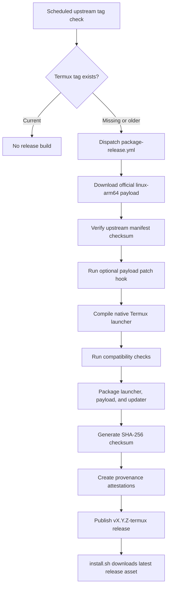

# Claude Code Termux

 [![npm]](https://www.npmjs.com/package/@anthropic-ai/claude-code)

[npm]: https://img.shields.io/npm/v/@anthropic-ai/claude-code.svg?style=flat-square

Claude Code is an agentic coding tool that lives in your terminal, understands your codebase, and helps you code faster by executing routine tasks, explaining complex code, and handling git workflows -- all through natural language commands. Use it in your terminal, IDE, or tag @claude on Github.

This fork packages the official Claude Code Linux arm64 binary for native Termux on Android. It does not carry the upstream source tree or commit upstream binaries. Instead, it tracks upstream `anthropics/claude-code` release tags, builds a small native Termux launcher around the official payload, and publishes Termux release artifacts.

**Learn more about Claude Code in the [official documentation](https://code.claude.com/docs/en/overview)**.

## Get Started On Termux

Install the latest Termux artifact:

```bash
curl -fsSL https://raw.githubusercontent.com/wallentx/claude-code-termux/dev/install.sh | bash
```

The installer downloads the latest `claude-termux-aarch64.tar.gz` release asset and installs:

```text
$PREFIX/bin/claude
$PREFIX/bin/claude.glibc
$PREFIX/bin/claude-termux-update
```

Requirements:

- native Termux on Android
- `aarch64`
- `glibc-repo` and `glibc`
- `ca-certificates`

For non-Termux platforms, use the official Claude Code installer:

```bash
curl -fsSL https://claude.ai/install.sh | bash
```

## Release Tracking

CI checks upstream Claude Code tags from `anthropics/claude-code` and compares them with this fork's `vX.Y.Z-termux` release tags. When upstream has a newer tag, or when this fork has no release yet, the scheduled detector dispatches the packaging workflow for the exact upstream version it found.

Release artifacts are built and runtime-tested in Termux on GitHub-hosted ARM runners through the shared `wallentx/gh-actions` Termux workflow. The build downloads the official upstream payload, verifies upstream metadata, compiles the native launcher, validates the release artifacts, attests the release assets, and publishes a GitHub release. Upstream and patched binaries stay out of git.



## Termux Compatibility Layer

The release archive contains three files:

```text
claude         # native Termux launcher
claude.glibc   # official linux-arm64 Claude payload
claude-termux-update # fork-owned transactional updater
```

The launcher exists because the upstream payload is a glibc Linux ELF, while Termux is an Android/Bionic environment. The launcher accounts for these boundaries:

- **Native Termux gate**: validates `$PREFIX`, `$TERMUX_VERSION`, and the Termux-style prefix before launching.
- **glibc loader path**: executes `$PREFIX/glibc/lib/ld-linux-aarch64.so.1 --library-path $PREFIX/glibc/lib ./claude.glibc`.
- **Bionic preload cleanup**: clears `LD_PRELOAD` and `LD_LIBRARY_PATH` so Termux/Bionic shims are not handed to the glibc loader.
- **CA bundle path**: sets `SSL_CERT_FILE=$PREFIX/etc/tls/cert.pem`.
- **Resolver bridge**: starts a native Bionic localhost CONNECT proxy, sets `HTTPS_PROXY`/`HTTP_PROXY` to that proxy, and sets `CLAUDE_CODE_PROXY_RESOLVES_HOSTS=true` so Claude network paths can let the proxy resolve upstream hostnames through Termux/Android DNS instead of reading `/etc/resolv.conf`.
- **Resolver hints**: keeps IPv4-first hints with `RES_OPTIONS`, `NODE_OPTIONS`, and `BUN_CONFIG_DNS_RESULT_ORDER` for code paths that still use embedded resolver settings. Set `CLAUDE_TERMUX_ALLOW_IPV6=1` to disable the IPv4 bias.
- **Temp paths**: ensures `TMPDIR` and `BUN_TMPDIR` use Termux-writable temp storage.
- **Browser handoff**: uses `termux-open-url` as `$BROWSER` when available so login URLs can open in Android.
- **Fork-owned updater**: intercepts `claude update`, `claude upgrade`, and `claude install` before the glibc payload runs. It downloads this fork's latest release artifact, requires a valid SHA-256 checksum, stages replacements beside the installed files, and rolls back if installation or the updated launcher smoke test fails. It replaces only `claude`, `claude.glibc`, and `claude-termux-update`; the glibc loader is never modified.

Use `claude update --check` to compare installed files with the latest release without changing them. Use `claude update --dry-run` to check local prerequisites without downloading.

If you already run a proxy, set `CLAUDE_TERMUX_PROXY`, `HTTPS_PROXY`, `HTTP_PROXY`, or `ALL_PROXY` before launching `claude`; the launcher will preserve it and still set `CLAUDE_CODE_PROXY_RESOLVES_HOSTS=true` when unset. To disable the embedded proxy fallback, set `CLAUDE_TERMUX_NO_DNS_PROXY=1`.

## Reporting Bugs

For Termux packaging issues, use this fork's issue tracker. For Claude Code product issues, use the `/bug` command or file an issue with upstream Anthropic Claude Code.

## Data Collection, Usage, And Retention

When you use Claude Code, Anthropic may collect feedback, which includes usage data, associated conversation data, and user feedback submitted via the `/bug` command.

See Anthropic's [data usage policies](https://code.claude.com/docs/en/data-usage), [Commercial Terms of Service](https://www.anthropic.com/legal/commercial-terms), and [Privacy Policy](https://www.anthropic.com/legal/privacy).
